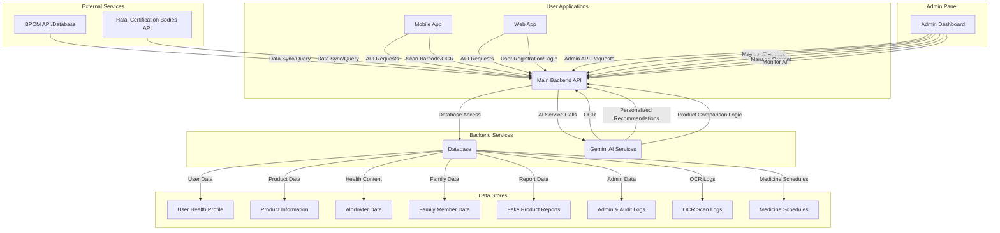

### **Detailed Analysis and Enhancement Plan for Halalytics Health Project**

#### **Executive Summary**

This report provides a comprehensive analysis of the Halalytics health project, identifying areas for improvement in data, UI/UX, feature utilization, and proposing new functionalities, including a robust admin panel. The goal is to transform Halalytics into a professional-grade health platform with granular control and advanced AI capabilities, focusing on personalized health and Halal product analysis.

---

#### **1. Analysis of Current State and Identified Gaps**

Based on the provided files (Halalytics/proposed_features.md, Halalytics/alodokter_data.json, Halalytics/models_list.json) and general project context, here's an analysis of the existing project and identified gaps:

##### **1.1. Existing Features (Inferred from proposed_features.md)**

The project appears to have foundational elements for product scanning and potentially basic health information lookup, given the Alodokter data. The [`proposed_features.md`](Halalytics/proposed_features.md) indicates a strong vision for advanced functionalities leveraging AI.

##### **1.2. Missing Data**

To achieve the proposed professional health project vision, several critical data points and data management capabilities are currently missing or need significant enhancement:

*   **Comprehensive User Health Data**:
    *   Detailed storage for individual user health profiles (height, weight, age, gender, pre-existing conditions, allergies).
    *   AI-calculated personalized daily limits for nutrients (sugar, salt, fat).
*   **Detailed Product Halal & Nutritional Data**:
    *   A robust and continuously updated database of Halal certifications, including the specific certification body and expiry.
    *   A granular list of ingredients for each product, with flags for "Halal Critical," "Syubhat," "Allergen," and "Dangerous Cosmetic Chemicals."
    *   Verified nutritional facts (calories, sugar, salt, fat per serving) for a vast array of products.
    *   Integration with external, authoritative databases like BPOM (Badan Pengawas Obat dan Makanan) for product registration and safety scores.
*   **Crowd-Sourced Reporting Data**:
    *   Structured storage for user-submitted reports on suspicious or fake products, including descriptions, photo evidence, and status tracking (e.g., "Pending Review," "Verified Fake").
*   **Family Member Health Data**:
    *   Dedicated profiles for family members linked to a primary user account, including their unique health conditions, allergies, and personalized dietary limits.
    *   Centralized medicine schedules for each family member.
*   **OCR Scan Logs**:
    *   Storage for raw text extracted from OCR scans and the subsequent AI analysis results.

##### **1.3. UI Deficiencies (Inferred, as direct UI access is unavailable)**

Assuming a typical initial application state, UI deficiencies likely revolve around the lack of specialized interfaces for the advanced proposed features and general user experience enhancements:

*   **Lack of Personalized Health Profile Interface**: No dedicated, interactive section for users to manage their health conditions, allergies, and view personalized dietary advice.
*   **Limited Product Comparison View**: Current UI likely lacks a clear, side-by-side "Versus Mode" for comparing multiple products with detailed, color-coded metrics and AI conclusions.
*   **Absence of Family Box Dashboard**: No centralized view to manage multiple family member profiles and see product analyses tailored to each individual.
*   **Missing Reporting Mechanism**: No prominent or guided interface for users to report suspicious products with photo uploads.
*   **Basic OCR/Scanning Feedback**: The current OCR (if any) might offer raw text output, but lacks intelligent highlighting, categorization, and actionable insights for ingredients.
*   **Generic UI/Visuals**: May lack the professional, clean, and trustworthy design elements crucial for a health application.
*   **No Admin Panel UI**: A complete absence of an administrative interface for system management.

##### **1.4. Underutilized Features**

*   **Alodokter Data**: The existing [`alodokter_data.json`](Halalytics/alodokter_data.json) is a rich health knowledge base. It can be more deeply integrated into:
    *   **AI Recommendations**: The Gemini AI could reference this data when generating personalized health advice or product warnings.
    *   **Educational Content**: Directly linking relevant Alodokter articles within personalized health profiles or product detail pages (e.g., "Learn more about [Allergen/Condition]").
    *   **Search Functionality**: A robust search within the app for health information from this dataset.
*   **Gemini AI Capabilities**: While planned for new features, the existing AI models (`models_list.json`) are likely underutilized in the current iteration if these proposed features are not fully implemented. Their potential extends beyond basic data processing to complex reasoning, personalization, and anomaly detection.

---

#### **2. Recommended New Features and Enhancements**

The [`proposed_features.md`](Halalytics/proposed_features.md) already outlines excellent new features. Here’s how they contribute to a professional health project, with additional context:

##### **2.1. Core User-Facing Features (from `proposed_features.md`)**

1.  **🧑‍⚕️ Health Profile (Profil Kesehatan Personal)**:
    *   **Enhancement**: This feature elevates personalization by providing AI-driven dietary guidance based on individual health conditions and allergies. It moves beyond generic health advice to actionable, user-specific insights.
2.  **⚖️ Comparison (Perbandingan Produk Cerdas)**:
    *   **Enhancement**: Empowers users to make informed choices between similar products by offering a data-rich, AI-analyzed comparison that includes health profile compatibility, halal status, and nutritional information.
3.  **👨‍👩‍👧‍👦 Family Box (Manajemen Kesehatan Keluarga)**:
    *   **Enhancement**: A crucial feature for family-centric households, allowing a single account to manage multiple health profiles and apply product analysis universally. The "Shared Medicine Schedule" adds a vital layer of family health coordination.
4.  **🚨 Fake Report (Laporan Pemalsuan & Crowd-Sourced Safety)**:
    *   **Enhancement**: Builds a community-driven safety net. It allows users to contribute to product integrity by reporting suspicious items, leveraging collective intelligence to protect consumers. This feeds directly into the Admin Panel for moderation.
5.  **📸 OCR Scanner (Pendeteksi Teks Komposisi / Skincare)**:
    *   **Enhancement**: Significantly expands the app's utility beyond barcode-enabled products, making Halalytics relevant for a wider range of local and imported goods. AI Vision is key here for accurate extraction and instant analysis of ingredients.

---

#### **3. Comprehensive Admin Panel Design**

A professional health project requires robust administrative control. The proposed Admin Panel offers granular management capabilities across all critical aspects of the platform.

##### **3.1. Architecture**

The Admin Panel will operate as a separate client application (either web-based or a dedicated desktop app) that communicates with the `Main Backend API`. This ensures a clear separation of concerns and enhances security.

##### **3.2. Key Modules and Functionalities (Control Penuh)**

*   **Dashboard Overview**: Centralized view of system health, key metrics (user growth, report volume), and critical alerts.
*   **User Management**:
    *   **Granular User Control**: View, search, filter, and sort all user accounts.
    *   **Profile Editing**: Edit user personal info, health conditions, allergies, and family members.
    *   **Account Actions**: Activate/deactivate, suspend, reset passwords, assign roles (e.g., premium users, beta testers).
    *   **Activity Logs**: View individual user activity (scans, reports).
*   **Content Management**:
    *   **Health Encyclopedia (Kamus Kesehatan)**: [IMPLEMENTED 2026-05-29] Full database-backed management of drugs, diseases, and healthy living tips.
    *   **Dynamic Content Control**: Create, edit, publish, or unpublish health articles, disease information, medicine details, and healthy living tips (using an intuitive Rich Text Editor).
    *   **Version Control**: Manage content drafts and revisions.
*   **Product Management**:
    *   **Comprehensive Product Database**: Manually add new products (especially for UMKM/non-barcoded items).
    *   **Detailed Product Editing**: Update all product attributes (name, brand, description, images, nutritional facts, BPOM details, Halal status, ingredients with flags).
    *   **Bulk Operations**: Import/export product data, perform bulk updates.
    *   **Ingredient Management**: Add, edit, remove individual ingredients and update their Halal/Allergen/Dangerous flags.
    *   **Warning Status Override**: Manually set or adjust product warning statuses.
*   **Fake Report Management**:
    *   **Centralized Report Review**: View all user-submitted reports on suspicious products.
    *   **Status Workflow**: Track reports through stages: "Pending Review," "Under Investigation," "Verified Fake," "Dismissed."
    *   **Evidence Review**: Access uploaded photo evidence and user descriptions.
    *   **Actionable Outcomes**: Update product status, issue warnings to users, or escalate issues to relevant authorities (e.g., BPOM).
*   **AI Model Management (Advanced)**:
    *   **Performance Monitoring**: Track the accuracy and efficiency of AI models (OCR, recommendation engine).
    *   **Configuration & Tuning**: Adjust AI parameters and thresholds (e.g., sensitivity of allergen detection).
    *   **Retraining Interface**: (Potentially) trigger model retraining with new validated data.
*   **System Configuration**: Manage application-wide settings, integrations with external APIs, and notification templates.
*   **Role-Based Access Control (RBAC)**: Define and assign roles (Super Admin, Moderator, Content Editor, Product Manager) with specific permissions to ensure secure and appropriate access to administrative functionalities.
*   **Audit Logs**: Maintain a detailed record of all administrative actions, who performed them, and when, for accountability and security.

---

#### **4. Conclusion and Next Steps**

By implementing these proposed features and a robust Admin Panel, Halalytics can evolve into a leading professional health project. It will offer unparalleled personalization, transparency in product analysis, and a strong community-driven safety mechanism, all managed through a powerful and granular administrative interface.

**Next Step**: The next step is to present this detailed plan to you for review and approval. Once approved, we can proceed to the implementation phase in `Code` mode.
